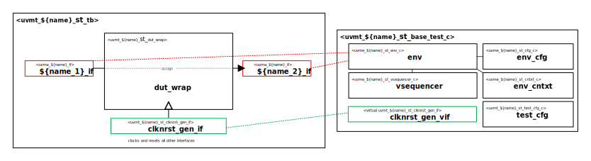

# {{ name_of_copyright_owner }} {{ name_normal_case }} Self-Test Bench and UVM Test Library

# About
This IP contains the {{ name_normal_case }} UVM Agent Self-Test Bench and Test Library.

# Block Diagram

# Directory Structure
* `bin` - Scripts, metadata and other miscellaneous files
* `docs` - Reference documentation
* `examples` - Code samples for adding to this test bench
* `src` - Source code

# Dependencies
It is dependent on the following IP:

* `uvm`
* `uvml`
* `uvml_logs`
* `uvml_sb`
* `uvma_{{ name }}`
* `uvme_{{ name }}_st`
