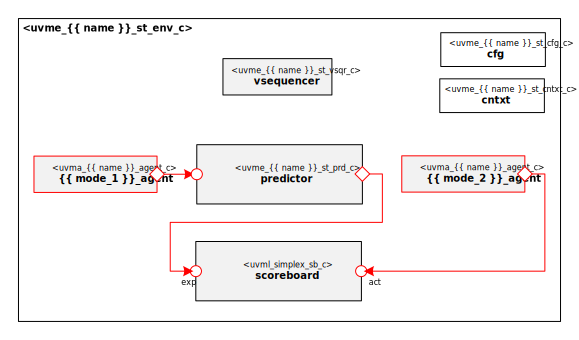

# A Word From Your Code Generator
Thank you for using the Moore.io Advanced UVM Agent Code Template for Serial protocols v1.0!

Your parameters are:
* Name: '{{ name }}'
* Full Name: '{{ full_name }}'
* Mode 1: '{{ mode_1 }}'
* Mode 2: '{{ mode_2 }}'
* Direction 1: '{{ tx }}'
* Direction 2: '{{ rx }}'
* Clocking: DDRSDR
* Interface Symmetry: {{ tx.upper() }} and {{ rx.upper() }} are the same{{ tx.upper() }} and {{ rx.upper() }} are NOT the same

If this is incorrect, it's recommended to delete the generated IP and re-generate with the correct parameters.

It is recommended to first go through the README for the Agent IP itself (`uvma_{{ name }}`). Only a few changes are needed at
the environment level:

## 1. Modify the logical transaction definition
### 1.1 Predictor - `uvme_{{ name }}_st_prd_c`
Modify the transaction cloning to match protocol frame definition.

# {{ name_of_copyright_owner }} {{ full_name }} UVM Agent Self-Test Environment

# About
This IP contains the {{ name_of_copyright_owner }} {{ full_name }} UVM Agent Self-Test Environment.

# Block Diagram

# Directory Structure
* `bin` - Scripts, metadata and other miscellaneous files
* `docs` - Documents describing the {{ full_name }} UVM Agent Self-Test Environment
* `examples` - Code samples for using and extending this environment
* `src` - Source code

# Dependencies
It IP is dependent on the following packages:

* `uvm_pkg`
* `uvml_pkg`
* `uvml_logs_pkg`
* `uvma_{{ name }}_pkg`
