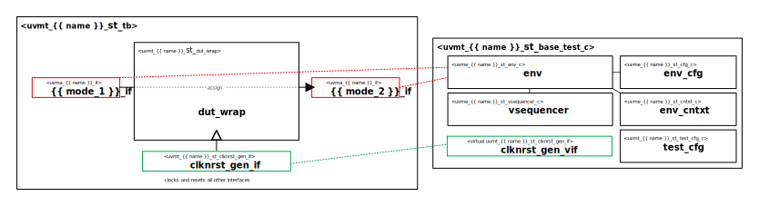

# {{ name_of_copyright_owner }} {{ full_name }} UVM Agent Self-Test Bench

# About
This IP contains the {{ name_of_copyright_owner }} {{ full_name }} UVM Agent Self-Test Bench.

# Block Diagram

# Directory Structure
* `bin` - Scripts, metadata and other miscellaneous files
* `docs` - Documents describing the {{ full_name }} UVM Agent Self-Test Bench
* `examples` - Code samples for extending this Test Bench
* `src` - Source code

# Dependencies
It IP is dependent on the following packages:

* `uvm_pkg`
* `uvml_pkg`
* `uvml_logs_pkg`
* `uvma_{{ name }}_pkg`
* `uvme_{{ name }}_st_pkg`
