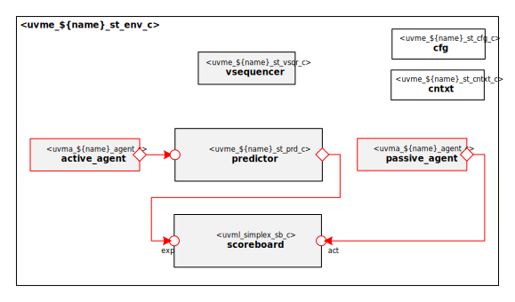

# ${name_of_copyright_owner} ${name_normal_case} Agent Self-Test UVM Environment

# About
This package contains the ${name_of_copyright_owner} ${name_normal_case} Agent Self-Test UVM Environment.
Its main purpose is to test the ${name_normal_case} UVM Agent (`uvma_${name}_pkg`) in isolation.

# Block Diagram

# Directory Structure
* `bin` - Scripts, metadata and other miscellaneous files
* `docs` - Reference documentation
* `examples` - Code samples for using and extending this environment
* `src` - Source code for this package

# Dependencies
It is dependent on the following packages:

* `uvm_pkg`
* `uvml_pkg`
* `uvml_logs_pkg`
* `uvml_sb_pkg`
* `uvma_${name}_pkg`
