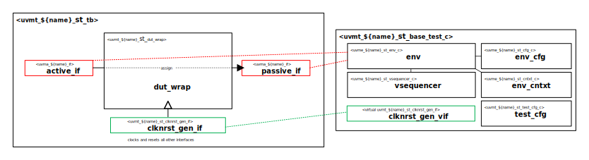

# ${name_of_copyright_owner} ${name_normal_case} Self-Test Bench and UVM Test Library

# About
This package contains the ${name_normal_case} UVM Agent Self-Test Bench and Test Library.

# Block Diagram

# Directory Structure
* `bin` - Scripts, metadata and other miscellaneous files
* `docs` - Reference documentation
* `examples` - Samples for users
* `src` - Source code for this package

# Dependencies
It is dependent on the following packages:

* `uvm_pkg`
* `uvml_pkg`
* `uvml_logs_pkg`
* `uvml_sb_pkg`
* `uvma_${name}_pkg`
* `uvme_${name}_st_pkg`
