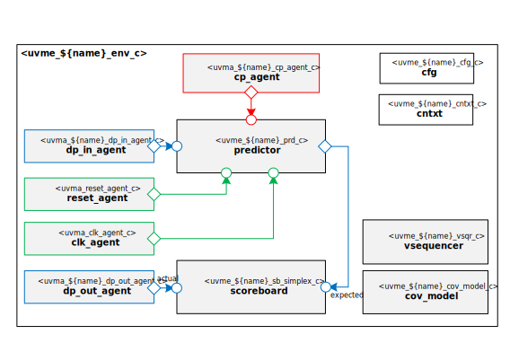

# ${name_of_copyright_owner} ${name_normal_case} Block UVM Environment

# About
This IP contains the ${name_of_copyright_owner} ${name_normal_case} Block UVM Environment.

TODO Describe ${name_normal_case}

# Block Diagram

# Directory Structure
* `bin` - Scripts, metadata and other miscellaneous files
* `docs` - Reference documentation
* `examples` - Code samples for using and extending this environment
* `src` - Source code

# Dependencies
It is dependent on the following IP:

* `uvm`
* `uvml`
* `uvml_logs`
* `uvml_sb`
* `uvml_ral`
* `uvma_clk`
* `uvma_reset`
* `uvma_${name}_cp`
* `uvma_${name}_dp`
