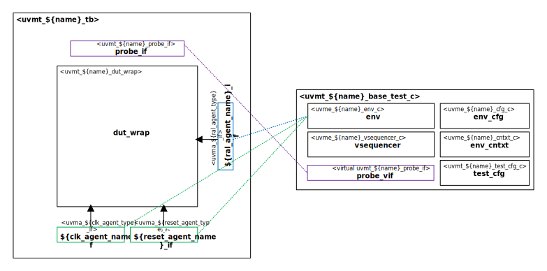

# ${name_of_copyright_owner} ${name_normal_case} Sub-System UVM Test Bench

# About
This package contains the ${name_of_copyright_owner} ${name_normal_case} Sub-System UVM Test Bench.

TODO Describe ${name_normal_case}

# Block Diagram

# Directory Structure
* `bin` - Scripts, metadata and other miscellaneous files
* `docs` - Documents describing the ${name_of_copyright_owner} ${name_normal_case} Sub-System UVM Test Bench
* `examples` - Samples for users
* `src` - Source code for this package

# Dependencies
It is dependent on the following packages:

* `uvm_pkg`
* `uvml_pkg`
* `uvml_logs_pkg`
* `uvml_sb_pkg`
* `uvma_${clk_agent_type}_pkg`
* `uvma_${reset_agent_type}_pkg`
* `uvma_${ral_agent_type}_pkg`
* `uvme_${name}_pkg`
* TODO Add ${name_normal_case} dependencies
